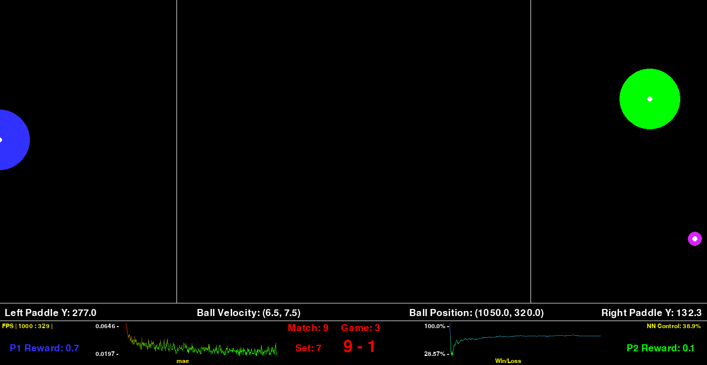
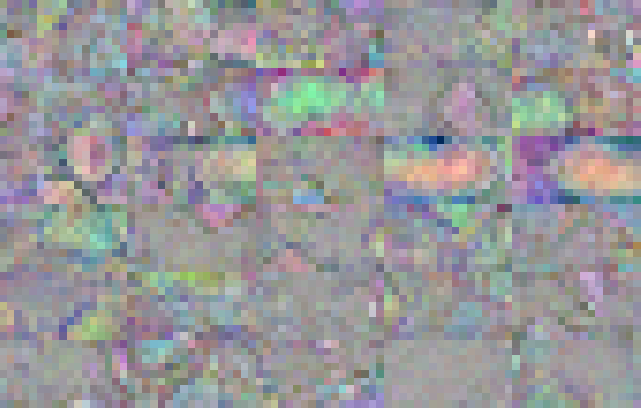

# Pong - DQN Implementation

## Table of Contents
- [Introduction](#introduction)
- [Installation](#installation)
- [Usage](#usage)
- [Training](#training)
- [Visualization](#Visualization)

## Demo
https://github.com/user-attachments/assets/cd31e141-70a7-4623-b5c3-3f5423535c02

## Introduction

The goal of this project is to create a Deep Q Network (DQN) that is capable of playing pong at human level performance or better. There is also some experimentation with implementation of alternate methods as well as visualization of weights. The pong game was built from scratch using pygame and runs quite fast. 

## Installation
Clone the repo
```bash
git clone git@github.com:JayQuimby/PongRL.git
```

Install requirements
```bash
pip install -r requirements.txt
```

## Usage

Run the Game

```bash
python game.py --mode x
```

Modes:
- 0: Training mode
- 1: Self play mode - non-training
- 2: Human vs. Ai

## Training
The training of the network happens over the course of about 1000 games. This is not required but shows good convergence in solutions. During the training phase the agent will switch back and forth between playing against itself, and playing a hand crafted solution.

### Episodic Memory
The agents has a memory that is stored and randomly queried every game to train the network on memories of actions that it has previously taken that lead to good rewards. This enables the agent to learn patterns over time and not have catastrophic forgetting.

### Decay
We use the principal of simulated aneling with the epsilon decay factor. this makes it so that we utilize the exploration-exploitation tradeoff and take random actions more at the start of training and then transition gradually to more network control.

### Self-Play
The network learns to play the game by playing against itself. This method was proven to be beneficial for RL methods in the AlphaGo and AlphaZero papers. 

### Vector Encoding
The encoding for the input that the model sees is a bit unique. It is a 3d grid of information encoding the position, velocity, and type of each object that is shown on screen. 

We use the color channels of the image to store the velocity vectors:
- X Velocity in the Red Channel
- Y Velocity in the Green Channel
- Object type in the Blue channel

This allows the network to view instantaneous velocity of any object on the screen. We then place that "color" in the location of the object on our 1/5 scale board. This scaled down board is then passed to the network. (Note: the representation is rotated 180 degrees to correct the view for the network or player 2)

We utilize the translational invariance of the CNN in order to capture the features present in the screen. This scheme allows for the network to successfully anticipate ball movements and play the game at a performant level. 


<div align="center">
  
</div>

The above image shows an example of a training run with the agent playing against itself.

## Visualization

Visualization for this project is done via a Jupyter notebook and some scripts that look into a simulated game. Take a look at `Visualize.ipynb` for a detailed look.

<div align="center">
  
</div>
The above are the visualized input layer weights. you can read this similar to a velocity map since the colors encode the velocity of any object at any location. There are some interesting patterns that arise.


<div align="center">
  
</div>
The above is a collage of the trained weights in a somewhat artistic format
